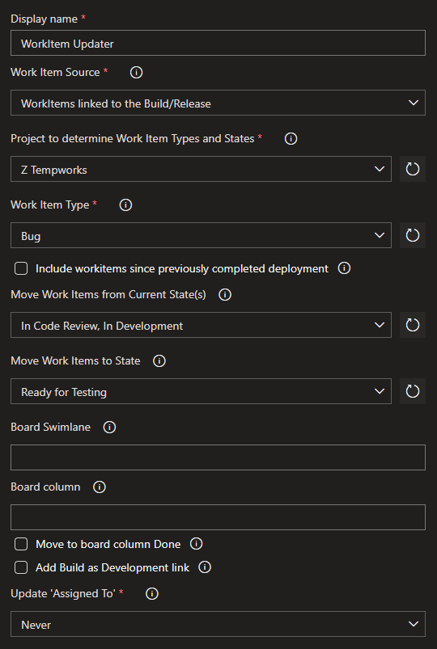

# WorkItem Updater

## Overview
The TempWorks WorkItem Updater task can update work items using a Query or that are linked to the Build/Release.  
The following workitem fields can be updated:
- Update the state for work items.  
- Update the assignee for work items.  
- Update the swimlane or board-column for work items.  
- Add the build as Development Link to the work items.
  
By adding this task to specific milestones in a build/release pipeline, you can create an automated kanban board.  
An example would be to set the state to 'Resolved' as the last step of a build and to 'Deployed' as the last step of a release.  
With this task the state of work items is always reflecting reality and developers don't need to manually update work items anymore.  

## Limitations

Work Item state updates are done via simple string compares without verifying which process or project a work item belongs to. This means that if multiple projects have different processes that share some states between work item types but not others, you can end up with errors as the project tries to move a work item to an invalid state. An example of this would be if you have two processes with `Bug` work items and one transitions from `In Code Review` to `Code Review Complete` and the other transitions from `In Code Review` to `Ready for Testing`. If work items from both are on the same pull request and you will get errors as it will try to move all bugs from `In Code Review` to `Code Review Complete` which will result in an invalid state for one of the processes. 

## Preview

A preview of what the task can do, can be seen in this recording:  
  
  
  
## Settings
  
  
## Version History
### 1.0.0
- Initial Version.
